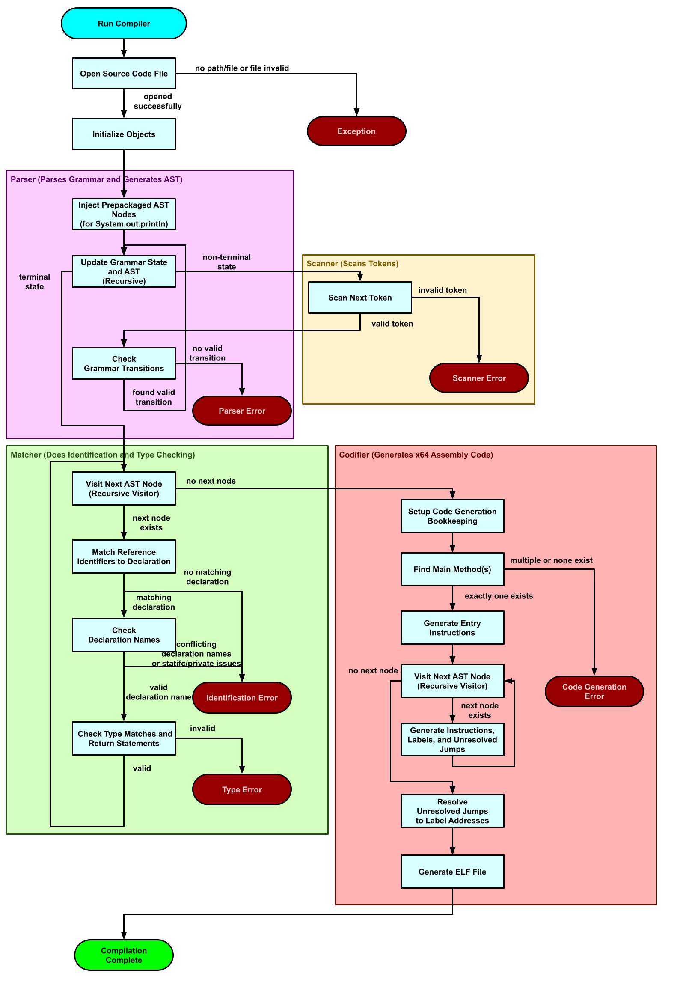
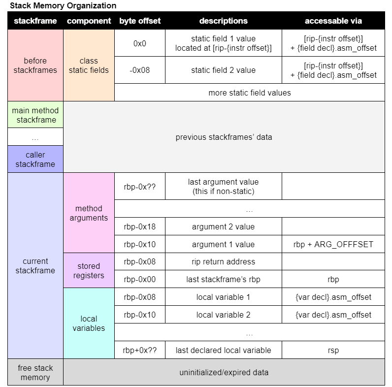

## Project Information
### Description
A compiler written in Java capable of compiling a reduced Java grammar known as MiniJava into x64 assembly targeting Linux.

### How to run
Compile with Java 12+ with the entry point at `project/code/src/miniJava/Compiler.java`. Then execute the jar file with the path to the source code file as the first argument.

### Attributions

Project designed and implemented as part of undergraduate compilers coursework.
- College - University of North Carolina at Chapel Hill
- Course - COMP 520 Compilers (Spring 2024)
- Instructor - Syed Ali ([github account](https://github.com/swali-unc))
- Student - Alexander Zhongqi Yoshida ([github account](https://github.com/mugicha101))
- Forked from [starter code repo](https://github.com/swali-unc/comp520-pa-starter)

### Readme formatting
File paths relative to `project/code/src/miniJava/`
`{descriptor}` refers to variable parts of paths specified by the descriptor\
(ex: `car_models/{car model name}_car.txt`)\
AST = Abstract Syntax Tree

### MiniJava Grammar
#### Format
Foo - Non-terminals\
`fizz {color}` - Terminals (raw text, descriptions surrounded by `{}`)\
*Foo* - Associated AST class name
X | Y - Choose X or Y
X* - Repitition
X? - Optional
#### Production Rules
| Production                                                                                            | AST Class Name    |
|:------------------------------------------------------------------------------------------------------|:------------------|
| Program ::= ClassDeclaration* `{End of File}`                                                         | Package           |
| ClassDeclaration ::= `class` Id `{`(FieldDeclaration \| MethodDeclaration)* `}`                       | ClassDecl         |
| FieldDeclaration ::= Visibility Access Type Id `;`                                                    | FieldDecl         |
| MethodDeclaration ::= Visibility Access (Type \| `void`) Id `(` ParameterList? `)` `{` Statement* `}` | MethodDecl        |
| Visibility ::= (`public` \| `private`)?                                                               | n/a               |
| Access ::= (`static`)?                                                                                | n/a               |
| Type ::= (BaseType \| Id)(`[]`)?                                                                      | TypeDenoter       |
| Id ::= `{letter}` (`{letter}` \| `_` \| `{digit}`)*                                                   | Identifier        |
| ParameterList ::= Type Id (`,` Type Id)*                                                              | ParameterDeclList |
| ArgumentList ::= Expression (`,` Expression)*                                                         | ExprList          |
| Reference ::= `id`                                                                                    | IdRef             |
| Reference ::= `this`                                                                                  | ThisRef           |
| Reference ::= Reference `.` Id                                                                        | QualRef           |
| Statement ::= `{` Statement* `}`                                                                      | BlockStmt         |
| Statement ::= `if` `(` Expression `)` Statement (`else` Statement)?                                   | IfStmt            |
| Statement ::= `while` `(` Expression `)` Statement                                                    | WhileStmt         |
| Statement ::= `for` `(` ShortStatement? `;` Expression? `;` ShortStatement? `)` Statement             | ForStmt           |
| Statement ::= ShortStatement `;`                                                                      | Stmt              |
| ShortStatement ::= Type Id `=` Expression                                                             | VarDeclStmt       |
| ShortStatement ::= Reference `=` Expression                                                           | AssignStmt        |
| ShortStatement ::= Reference `[` Expression `]` = Expression                                          | IxAssignStmt      |
| ShortStatement ::= Reference `(` ArgumentList? `)`                                                    | CallStmt          |
| ShortStatement ::= `return` Expression?                                                               | ReturnStmt        |
| Expression ::= Reference                                                                              | RefExpr           |
| Expression ::= Reference `[` Expression `]`                                                           | IxExpr            |
| Expression ::= Reference `(` ArgumentList? `)`                                                        | CallExpr          |
| Expression ::= UnOp Expression                                                                        | UnaryExpr         |
| Expression ::= Expression BinOp Expression                                                            | BinaryExpr        |
| Expression ::= `(` Type `)` Expression                                                                | CastExpr          |
| Expression ::= `(` Expression `)`                                                                     | Expression        |
| Expression ::= `{value or null or char}`                                                              | LiteralExpr       |
| Expression ::= `new` Id `()`                                                                          | NewObjectExpr     |
| Expression ::= `new` (BaseType \| Id) `[` Expression `]`                                              | NewArrayExpr      |
| BaseType ::=  `int` \| `long` \| `boolean` \| `char` \| `float` \| `double`                           | BaseType          |
| UnOp ::= `-` \| `!`                                                                                   | Operator          |
| BinOp ::= `+` \| `-` \| `*` \| `/` \| `&&` \| `\|\|` \|                                               | Operator          |
#### Comments
`// single line`\
`/* multiline */`
#### Prepackaged Members
`System.out.println(x);` allows you to print the ascii value `x` (`x` is type `int`)
`array.length` allows you to get the length of array objects (is an int, cannot be assigned to)
#### Base Type Examples
`boolean foo = false;`\
`char foo = 'a'; // 1 byte signed integer value`\
`int foo = 0; // 4 bytes signed integer value`\
`long foo = 0L; // 8 byte signed integer value`\
`float foo = 0.5f; // 4 byte floating point value`\
`double foo = 1.5; // 8 byte floating point value`
#### Type Casting Examples
`int a = 0;`\
`long b = a;`\
`a = (int)b;`\
`float f = (float)b;`

### Directory Structure
Note: certain files omitted for brevity\
`project` - root directory
- `code/src/miniJava` - project code
    - `AbstractSyntaxTrees` - AST class files
    - `CodeGeneration` - assembly code generation code
    - `ContextualAnalysis` - identification and typechecking code
    - `SyntacticAnalyzer` - token scanner and AST parser code
    - `UnitTests` - testing framework
        - `failed_test_outputs` - failed unit tests from UnitTester.java
        - `tests` - test inputs for `UnitTester.java`
        - `UnitTester.java` - runs unit tests for AST generation
        - `AssemblyTester.java` - runs unit tests for code generation
    - `Compiler.java` - entry class to run compilation
- `a.out` - ELF file generated by `Compiler.java`
- `test.out` - blank ELF file generated by `AssemblyTester.java`

### Compilation Control Flow Diagram

## Design and Implementation
### Syntactic Analysis
#### Goal
Convert the input file into tokens and parse the tokens using the MiniJava grammar into an Abstract Syntax Tree (AST).
#### Tokens
Tokens define the terminals of the MiniJava grammar and are essentially the smallest unit of syntax.\
Token types located in `SyntacticAnalyzer/TokenType`\
#### Code
Scanner (`SyntacticAnalyzer/Scanner.java`) - scans source file content into tokens\
Parser (`SyntacticAnalyzer/Parser.java`) - converts tokens into AST
Note\
Parser and Scanner run in conjunction
- Parser queries scanner for next token
- Scanner reads one token at a time from source file when requested by Parser
#### AST Generation
Base AST and Visitor Design Pattern knowledge assumed
- [AST Wikipedia entry](https://en.wikipedia.org/wiki/Abstract_syntax_tree)
- [Visitor Pattern Wikipedia entry](https://en.wikipedia.org/wiki/Visitor_pattern)

AST generation handled by the parser using Top Down Parsing\
- Top Down Parsing implemented using Recursive Descent, althought there is an outdated Pushdown Automata implementation inside the parser that does not produce an AST.

AST class code and visitor interface located in `AbstractSyntaxTrees`.\
Any changes not listed in `AbstractSyntaxTrees/ASTChanges.txt` come from the starter code.\
Error messages follow format listed under Syntax Analysis section
#### Error Messages
Error messages have descriptions, line number, and offset within line (format: `{line}:{offset} {description}`)\
Error reporting details located in ErrorReporter.java
### Contextual Analysis
#### Goal
Traverse the AST and perform identification and type checking on identifiers (names). This also results in the AST gaining decorations (additional data).
#### Identification
Match identifiers to their corresponding declaration within the current scope.\
Make sure name shadowing rules are followed and private/static properties of declarations are followed.
#### Type Checking
Ensure expressions, statements, etc. perform their operations on the expected data type.
#### Shadowing Rules
If an identifier shares the name of multiple active declarations, shadowing rules determines which one has priority.
Declarations are organized into levels, with the highest level getting priority.
- Level 0 - Class declarations
- Level 1 - Class member declarations
- Level 2+ - Local variables (each nested scope adds a level)
#### Type Casting
Certain base types can be cast to other types either implicitly or with explicit casts.\
Implicit casts: char to int, int to long, char to long, and float to double.\
Explicit casts: any other cast between char, int, long, float, and double.

A local variable cannot shadow another local variable.
#### Code
Identification and Type Checking are done in a single pass.
The current identifier to declaration mappings are stored in the id table (`ContextualAnalysis/IdTable`) which also handles scoping levels and shadowing.
#### Error Messages
Error messages follow format listed under Syntax Analysis section. Care was taken to make them decently helpful but no guarantees!

### Code Generation
#### Goal
Convert the decorated AST into x64 assembly code and package it into an ELF file that can be executed on a Linux kernel.
#### Data Handling
All data 8 byte aligned.\
Objects are located on the heap and get 4096 bytes of memory each.
Objects are represented by their pointers rather than direct data, and as a result, they are passed around by reference while primitive types are passed around by value.\
Math operations handled by the ALUHandler (`CodeGeneration/ALUHandler.java`).\
Floating point operations handled by the FPUHandler(`CodeGeneration/FPUHandler.java`).
#### Static/Nonstatic Data Handling
Static class field data is stored at the bottom of the stack.\
The location of the bottom of the stack is written into the start of the `.text` segment at the start of execution, and is accessible by offsetting the current `rip` register value by the instruction's byte offset in the `.text` segment.
Nonstatic data is stored in the current stackframe.
#### Static/Nonstatic Method Handling
Nonstatic methods have an implicit parameter referring to `this`, while nonstatic methods do not.\
The implicit `this` parameter comes serially after other parameters, and is not explicitly passed as an argument in the source code.
#### Stack Handling
The stack size is always a multiple of 8 bytes since only 8 byte values are used.\
Expressions pop any inputs they need off the stack and push the output onto the stack.\
Statements pop any inputs they need off the stack and only push values onto the stack if they are variable declarations.\
Calls evaluate their argument expressions from last to first, meaning the first argument is highest on the stack.\
If calling a nonstatic method, a reference to the current object (`this`) is pushed first onto the stack.
#### Stack Organization

### Unit Testing Framework
Unit Tester (`UnitTests/UnitTester.java`) - AST Generation Testing
- Unit tests specified in `UnitTests/tests`
  - Input file - `{test name}_input.txt`.
  - Expected output file - `{test name}_expected.txt`.
  - Unit tester checks if output matches input.
  - Failed test results written to `UnitTests/failed_test_outputs/{test_name}`.
- Assembly Tester (`UnitTests/AssemblyTester.java`) - Code Generation Testing\
  - All unit tests listed implemented directly as code in main method.
  - Generates a test elf (`test.out`) after all instruction generation tests pass.